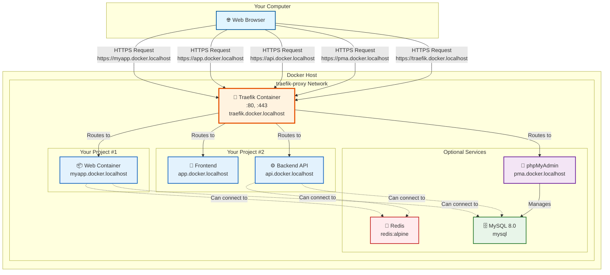

# Network Topology Diagram

This diagram illustrates how the Local Docker Proxy architecture connects your browser, Traefik proxy, and your project containers.

## Architecture Overview



## Connection Flow

### 1. HTTPS Request Flow
1. **Browser** sends HTTPS request to `https://myapp.docker.localhost`
2. **Local DNS** resolves `*.docker.localhost` to `127.0.0.1` (localhost)
3. **Traefik** receives request on port 443 (HTTPS)
4. **Traefik** checks routing rules based on hostname
5. **Traefik** forwards request to appropriate container
6. **Container** responds back through Traefik
7. **Browser** receives response over HTTPS

### 2. SSL/TLS Certificate Chain
```
Browser
  ↓ (trusts)
Local Certificate Authority (mkcert)
  ↓ (issues)
Wildcard Certificate (*.docker.localhost)
  ↓ (presented by)
Traefik Container
```

### 3. Network Connectivity

All services shown in the diagram are connected to the **`traefik-proxy`** Docker network. This allows:

- **Traefik** to route requests to any container
- **Your projects** to communicate with optional services (MySQL, Redis)
- **Isolation** from other Docker networks
- **No port conflicts** (containers don't expose ports to host)

## Key Components

### Traefik Container
- **Role:** Reverse proxy and load balancer
- **Ports Exposed:** 80 (HTTP), 443 (HTTPS)
- **Dashboard:** `https://traefik.docker.localhost`
- **Configuration:** Labels on containers define routing rules

### traefik-proxy Network
- **Type:** External Docker bridge network
- **Purpose:** Connect all proxied services
- **Creation:** `docker network create traefik-proxy`
- **Scope:** Shared across all Docker Compose projects

### Optional Services
- **Redis:** In-memory cache/database (no HTTP routing)
- **MySQL:** Relational database (no HTTP routing)
- **phpMyAdmin:** Web interface for MySQL at `https://pma.docker.localhost`

### Your Project Containers
- **Connected:** To `traefik-proxy` network
- **Labeled:** With Traefik routing configuration
- **Accessible:** Via `https://<name>.docker.localhost`
- **Internal Communication:** Can connect to MySQL/Redis by container name

## Label Configuration Example

For a container to be routed by Traefik, it needs these labels:

```yaml
services:
  app:
    image: nginx:alpine
    networks:
      - traefik-proxy
    labels:
      - "traefik.enable=true"
      - "traefik.http.routers.myapp.rule=Host(`myapp.docker.localhost`)"
      - "traefik.http.routers.myapp.tls=true"

networks:
  traefik-proxy:
    external: true
```

## Diagram Legend

| Symbol | Meaning |
|--------|---------|
| `→` | HTTPS Request/Response |
| `-.->` | Internal Docker network connection |
| 🌐 | Web Browser |
| 🔀 | Reverse Proxy (Traefik) |
| 💾 | Cache Service (Redis) |
| 🗄️ | Database Service (MySQL) |
| 🔧 | Admin Tool (phpMyAdmin) |
| 📦 | Application Container |
| 🎨 | Frontend Application |
| ⚙️ | Backend API |

## Multiple Projects

Notice that **Project #1** and **Project #2** are completely separate Docker Compose projects, but both:
- Connect to the same `traefik-proxy` network
- Are routed by the same Traefik instance
- Have unique domains (`myapp.docker.localhost` vs `app.docker.localhost`)
- Can share access to MySQL and Redis if needed

This architecture allows you to:
- Run dozens of projects simultaneously
- Avoid port conflicts (everything uses 80/443 through Traefik)
- Use consistent HTTPS domains
- Share common services (databases, caches)

## Related Documentation

- [Integration Guide](../INTEGRATION_GUIDE.md) - Detailed setup instructions
- [Main README](../../README.md) - Project overview and installation
